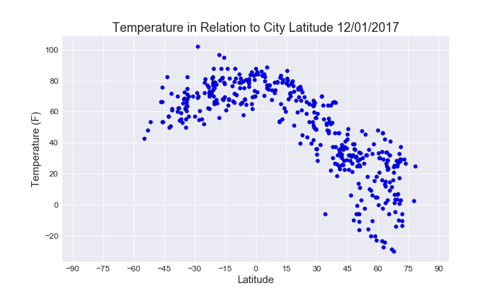
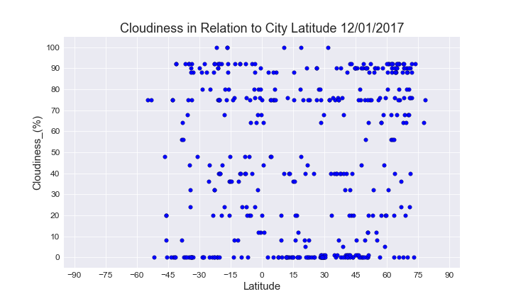
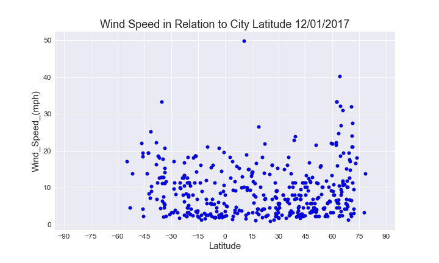

Observed Trends:

- Temperatures south of the equator appear to be higher at this time of the year
- Temperatures north of the equator appear to be lower at this time of the year
- There does not appear to be a significant relationship between cloudiness and latitude in this sample


```python
# import dependencies
import pandas as pd
import numpy as np 
import requests as req 
import matplotlib.pyplot as plt
import seaborn as sns
from datetime import datetime
from citipy import citipy
from api_keys import APPID
```


```python
# retrive date
date = datetime.today()
cur_date = date.strftime('%m/%d/%Y')
```


```python
# retrive sample cities from python library
# define sample size
# sample_size = int(input('How many cities would you like to include in analysis? '))
sample_size = 500

# create dictionary to store sample city data
sample_cities = {
    'Country_Code': [],
    'City_Name': [],
    'Latitude': [],
    'Longitude': []
}

while len(sample_cities['Country_Code']) < sample_size:
            
    # define random latitue and longitude
    lat = round(np.random.uniform(-90,90),2)
    lng = round(np.random.uniform(-180, 180),2)

    # find nearest city to random lat, lng point
    city = citipy.nearest_city(lat, lng)

    # retrive name of city
    name = city.city_name

    # retrive country code of city
    code = city.country_code

    if name not in sample_cities['City_Name']:

        # add city data to sample_cities dictionary
        sample_cities['Country_Code'].append(code)
        sample_cities['City_Name'].append(name)
        sample_cities['Latitude'].append(lat)
        sample_cities['Longitude'].append(lng)

# create dataframe with sample_cities dictionary
city_df = pd.DataFrame(sample_cities)

city_df.head()
```


<div>
<style>
    .dataframe thead tr:only-child th {
        text-align: right;
    }

    .dataframe thead th {
        text-align: left;
    }

    .dataframe tbody tr th {
        vertical-align: top;
    }
</style>
<table border="1" class="dataframe">
  <thead>
    <tr style="text-align: right;">
      <th></th>
      <th>City_Name</th>
      <th>Country_Code</th>
      <th>Latitude</th>
      <th>Longitude</th>
    </tr>
  </thead>
  <tbody>
    <tr>
      <th>0</th>
      <td>ushuaia</td>
      <td>ar</td>
      <td>-77.94</td>
      <td>-52.27</td>
    </tr>
    <tr>
      <th>1</th>
      <td>pochutla</td>
      <td>mx</td>
      <td>10.54</td>
      <td>-96.78</td>
    </tr>
    <tr>
      <th>2</th>
      <td>rikitea</td>
      <td>pf</td>
      <td>-57.54</td>
      <td>-132.92</td>
    </tr>
    <tr>
      <th>3</th>
      <td>hermanus</td>
      <td>za</td>
      <td>-46.04</td>
      <td>14.02</td>
    </tr>
    <tr>
      <th>4</th>
      <td>lebu</td>
      <td>cl</td>
      <td>-35.63</td>
      <td>-77.08</td>
    </tr>
  </tbody>
</table>
</div>


```python
# add columns for weather data
city_df['Temperature_(F)'] = ''
city_df['Humidity_(%)'] = ''
city_df['Cloudiness_(%)'] = ''
city_df['Wind_Speed_(mph)'] = ''

city_df.head()
```


<div>
<style>
    .dataframe thead tr:only-child th {
        text-align: right;
    }

    .dataframe thead th {
        text-align: left;
    }

    .dataframe tbody tr th {
        vertical-align: top;
    }
</style>
<table border="1" class="dataframe">
  <thead>
    <tr style="text-align: right;">
      <th></th>
      <th>City_Name</th>
      <th>Country_Code</th>
      <th>Latitude</th>
      <th>Longitude</th>
      <th>Temperature_(F)</th>
      <th>Humidity_(%)</th>
      <th>Cloudiness_(%)</th>
      <th>Wind_Speed_(mph)</th>
    </tr>
  </thead>
  <tbody>
    <tr>
      <th>0</th>
      <td>ushuaia</td>
      <td>ar</td>
      <td>-77.94</td>
      <td>-52.27</td>
      <td></td>
      <td></td>
      <td></td>
      <td></td>
    </tr>
    <tr>
      <th>1</th>
      <td>pochutla</td>
      <td>mx</td>
      <td>10.54</td>
      <td>-96.78</td>
      <td></td>
      <td></td>
      <td></td>
      <td></td>
    </tr>
    <tr>
      <th>2</th>
      <td>rikitea</td>
      <td>pf</td>
      <td>-57.54</td>
      <td>-132.92</td>
      <td></td>
      <td></td>
      <td></td>
      <td></td>
    </tr>
    <tr>
      <th>3</th>
      <td>hermanus</td>
      <td>za</td>
      <td>-46.04</td>
      <td>14.02</td>
      <td></td>
      <td></td>
      <td></td>
      <td></td>
    </tr>
    <tr>
      <th>4</th>
      <td>lebu</td>
      <td>cl</td>
      <td>-35.63</td>
      <td>-77.08</td>
      <td></td>
      <td></td>
      <td></td>
      <td></td>
    </tr>
  </tbody>
</table>
</div>


```python
# gather weather information
weather_url = 'http://api.openweathermap.org/data/2.5/weather'

params = {
    'q': '',
    'units': 'imperial',
    'APPID': APPID
}

for index, row in city_df.iterrows():
    
    # change params 'q' to city name country code pair
    params['q'] = f'{row["City_Name"]},{row["Country_Code"]}'

    # request weather data
    weather_req = req.get(weather_url, params=params).json()    

    print(f'Now processing city #{index} {row["City_Name"]}. url: {weather_url}?APPID=APPID&q={params["q"]}&units={params["units"]}')
    
    try:
        
        # collect weather info
        temparature = weather_req['main']['temp']
        humidity = weather_req['main']['humidity']
        cloudiness = weather_req['clouds']['all']
        wind_speed = weather_req['wind']['speed']
        actual_lon = weather_req["coord"]["lon"]
        actual_lat = weather_req["coord"]["lat"]
        
        # add data to dataframe
        city_df.set_value(index, 'Temperature_(F)', temparature)
        city_df.set_value(index, 'Humidity_(%)', humidity)
        city_df.set_value(index, 'Cloudiness_(%)', cloudiness)
        city_df.set_value(index, 'Wind_Speed_(mph)', wind_speed)
        city_df.set_value(index, 'Latitude', actual_lat)
        city_df.set_value(index, 'Longitude', actual_lon)

    except KeyError:
    
        print(f'No weather info available for {row["City_Name"]}')
        city_df.set_value(index, 'Temperature_(F)', np.nan)
        city_df.set_value(index, 'Humidity_(%)', np.nan)
        city_df.set_value(index, 'Cloudiness_(%)', np.nan)
        city_df.set_value(index, 'Wind_Speed_(mph)', np.nan)

city_df.head()
```

    Now processing city #0 ushuaia. url: http://api.openweathermap.org/data/2.5/weather?APPID=APPID&q=ushuaia,ar&units=imperial
    Now processing city #1 pochutla. url: http://api.openweathermap.org/data/2.5/weather?APPID=APPID&q=pochutla,mx&units=imperial
    No weather info available for pochutla
    Now processing city #2 rikitea. url: http://api.openweathermap.org/data/2.5/weather?APPID=APPID&q=rikitea,pf&units=imperial
    Now processing city #3 hermanus. url: http://api.openweathermap.org/data/2.5/weather?APPID=APPID&q=hermanus,za&units=imperial
    Now processing city #4 lebu. url: http://api.openweathermap.org/data/2.5/weather?APPID=APPID&q=lebu,cl&units=imperial
    Now processing city #5 punta arenas. url: http://api.openweathermap.org/data/2.5/weather?APPID=APPID&q=punta arenas,cl&units=imperial
    Now processing city #6 kirakira. url: http://api.openweathermap.org/data/2.5/weather?APPID=APPID&q=kirakira,sb&units=imperial
    Now processing city #7 puerto escondido. url: http://api.openweathermap.org/data/2.5/weather?APPID=APPID&q=puerto escondido,mx&units=imperial
    Now processing city #8 narsaq. url: http://api.openweathermap.org/data/2.5/weather?APPID=APPID&q=narsaq,gl&units=imperial
    Now processing city #9 tekax. url: http://api.openweathermap.org/data/2.5/weather?APPID=APPID&q=tekax,mx&units=imperial
    No weather info available for tekax
    Now processing city #10 aqtobe. url: http://api.openweathermap.org/data/2.5/weather?APPID=APPID&q=aqtobe,kz&units=imperial
    Now processing city #11 busselton. url: http://api.openweathermap.org/data/2.5/weather?APPID=APPID&q=busselton,au&units=imperial
    Now processing city #12 tynda. url: http://api.openweathermap.org/data/2.5/weather?APPID=APPID&q=tynda,ru&units=imperial
    Now processing city #13 hobart. url: http://api.openweathermap.org/data/2.5/weather?APPID=APPID&q=hobart,au&units=imperial
    Now processing city #14 umm lajj. url: http://api.openweathermap.org/data/2.5/weather?APPID=APPID&q=umm lajj,sa&units=imperial
    Now processing city #15 johnstown. url: http://api.openweathermap.org/data/2.5/weather?APPID=APPID&q=johnstown,us&units=imperial
    Now processing city #16 codrington. url: http://api.openweathermap.org/data/2.5/weather?APPID=APPID&q=codrington,ag&units=imperial
    No weather info available for codrington
    Now processing city #17 berlevag. url: http://api.openweathermap.org/data/2.5/weather?APPID=APPID&q=berlevag,no&units=imperial
    Now processing city #18 new norfolk. url: http://api.openweathermap.org/data/2.5/weather?APPID=APPID&q=new norfolk,au&units=imperial
    Now processing city #19 taltal. url: http://api.openweathermap.org/data/2.5/weather?APPID=APPID&q=taltal,cl&units=imperial
    Now processing city #20 taolanaro. url: http://api.openweathermap.org/data/2.5/weather?APPID=APPID&q=taolanaro,mg&units=imperial
    No weather info available for taolanaro
    Now processing city #21 avarua. url: http://api.openweathermap.org/data/2.5/weather?APPID=APPID&q=avarua,ck&units=imperial
    Now processing city #22 belushya guba. url: http://api.openweathermap.org/data/2.5/weather?APPID=APPID&q=belushya guba,ru&units=imperial
    No weather info available for belushya guba
    Now processing city #23 ulverstone. url: http://api.openweathermap.org/data/2.5/weather?APPID=APPID&q=ulverstone,au&units=imperial
    Now processing city #24 albany. url: http://api.openweathermap.org/data/2.5/weather?APPID=APPID&q=albany,au&units=imperial
    Now processing city #25 upernavik. url: http://api.openweathermap.org/data/2.5/weather?APPID=APPID&q=upernavik,gl&units=imperial
    Now processing city #26 lavrentiya. url: http://api.openweathermap.org/data/2.5/weather?APPID=APPID&q=lavrentiya,ru&units=imperial
    Now processing city #27 aberdeen. url: http://api.openweathermap.org/data/2.5/weather?APPID=APPID&q=aberdeen,us&units=imperial
    Now processing city #28 chokurdakh. url: http://api.openweathermap.org/data/2.5/weather?APPID=APPID&q=chokurdakh,ru&units=imperial
    Now processing city #29 flin flon. url: http://api.openweathermap.org/data/2.5/weather?APPID=APPID&q=flin flon,ca&units=imperial
    Now processing city #30 sentyabrskiy. url: http://api.openweathermap.org/data/2.5/weather?APPID=APPID&q=sentyabrskiy,ru&units=imperial
    No weather info available for sentyabrskiy
    Now processing city #31 bjornevatn. url: http://api.openweathermap.org/data/2.5/weather?APPID=APPID&q=bjornevatn,no&units=imperial
    Now processing city #32 hambantota. url: http://api.openweathermap.org/data/2.5/weather?APPID=APPID&q=hambantota,lk&units=imperial
    Now processing city #33 chuy. url: http://api.openweathermap.org/data/2.5/weather?APPID=APPID&q=chuy,uy&units=imperial
    Now processing city #34 rochegda. url: http://api.openweathermap.org/data/2.5/weather?APPID=APPID&q=rochegda,ru&units=imperial
    Now processing city #35 siniscola. url: http://api.openweathermap.org/data/2.5/weather?APPID=APPID&q=siniscola,it&units=imperial
    Now processing city #36 kyshtovka. url: http://api.openweathermap.org/data/2.5/weather?APPID=APPID&q=kyshtovka,ru&units=imperial
    Now processing city #37 tsihombe. url: http://api.openweathermap.org/data/2.5/weather?APPID=APPID&q=tsihombe,mg&units=imperial
    No weather info available for tsihombe
    Now processing city #38 arraial do cabo. url: http://api.openweathermap.org/data/2.5/weather?APPID=APPID&q=arraial do cabo,br&units=imperial
    Now processing city #39 sochi. url: http://api.openweathermap.org/data/2.5/weather?APPID=APPID&q=sochi,ru&units=imperial
    Now processing city #40 vaini. url: http://api.openweathermap.org/data/2.5/weather?APPID=APPID&q=vaini,to&units=imperial
    Now processing city #41 turukhansk. url: http://api.openweathermap.org/data/2.5/weather?APPID=APPID&q=turukhansk,ru&units=imperial
    Now processing city #42 butaritari. url: http://api.openweathermap.org/data/2.5/weather?APPID=APPID&q=butaritari,ki&units=imperial
    Now processing city #43 sorvag. url: http://api.openweathermap.org/data/2.5/weather?APPID=APPID&q=sorvag,fo&units=imperial
    No weather info available for sorvag
    Now processing city #44 port alfred. url: http://api.openweathermap.org/data/2.5/weather?APPID=APPID&q=port alfred,za&units=imperial
    Now processing city #45 zlatoustovsk. url: http://api.openweathermap.org/data/2.5/weather?APPID=APPID&q=zlatoustovsk,ru&units=imperial
    No weather info available for zlatoustovsk
    Now processing city #46 piranhas. url: http://api.openweathermap.org/data/2.5/weather?APPID=APPID&q=piranhas,br&units=imperial
    Now processing city #47 yar-sale. url: http://api.openweathermap.org/data/2.5/weather?APPID=APPID&q=yar-sale,ru&units=imperial
    Now processing city #48 qaanaaq. url: http://api.openweathermap.org/data/2.5/weather?APPID=APPID&q=qaanaaq,gl&units=imperial
    Now processing city #49 porto nacional. url: http://api.openweathermap.org/data/2.5/weather?APPID=APPID&q=porto nacional,br&units=imperial
    Now processing city #50 illoqqortoormiut. url: http://api.openweathermap.org/data/2.5/weather?APPID=APPID&q=illoqqortoormiut,gl&units=imperial
    No weather info available for illoqqortoormiut
    Now processing city #51 castro. url: http://api.openweathermap.org/data/2.5/weather?APPID=APPID&q=castro,cl&units=imperial
    Now processing city #52 yellowknife. url: http://api.openweathermap.org/data/2.5/weather?APPID=APPID&q=yellowknife,ca&units=imperial
    Now processing city #53 dikson. url: http://api.openweathermap.org/data/2.5/weather?APPID=APPID&q=dikson,ru&units=imperial
    Now processing city #54 muros. url: http://api.openweathermap.org/data/2.5/weather?APPID=APPID&q=muros,es&units=imperial
    Now processing city #55 tumannyy. url: http://api.openweathermap.org/data/2.5/weather?APPID=APPID&q=tumannyy,ru&units=imperial
    No weather info available for tumannyy
    Now processing city #56 nizhneyansk. url: http://api.openweathermap.org/data/2.5/weather?APPID=APPID&q=nizhneyansk,ru&units=imperial
    No weather info available for nizhneyansk
    Now processing city #57 kavieng. url: http://api.openweathermap.org/data/2.5/weather?APPID=APPID&q=kavieng,pg&units=imperial
    Now processing city #58 lompoc. url: http://api.openweathermap.org/data/2.5/weather?APPID=APPID&q=lompoc,us&units=imperial
    Now processing city #59 chachapoyas. url: http://api.openweathermap.org/data/2.5/weather?APPID=APPID&q=chachapoyas,pe&units=imperial
    Now processing city #60 bilibino. url: http://api.openweathermap.org/data/2.5/weather?APPID=APPID&q=bilibino,ru&units=imperial
    Now processing city #61 barrow. url: http://api.openweathermap.org/data/2.5/weather?APPID=APPID&q=barrow,us&units=imperial
    Now processing city #62 attawapiskat. url: http://api.openweathermap.org/data/2.5/weather?APPID=APPID&q=attawapiskat,ca&units=imperial
    No weather info available for attawapiskat
    Now processing city #63 batagay. url: http://api.openweathermap.org/data/2.5/weather?APPID=APPID&q=batagay,ru&units=imperial
    Now processing city #64 martos. url: http://api.openweathermap.org/data/2.5/weather?APPID=APPID&q=martos,es&units=imperial
    Now processing city #65 bengkulu. url: http://api.openweathermap.org/data/2.5/weather?APPID=APPID&q=bengkulu,id&units=imperial
    Now processing city #66 kuruman. url: http://api.openweathermap.org/data/2.5/weather?APPID=APPID&q=kuruman,za&units=imperial
    Now processing city #67 atar. url: http://api.openweathermap.org/data/2.5/weather?APPID=APPID&q=atar,mr&units=imperial
    Now processing city #68 santa eulalia del rio. url: http://api.openweathermap.org/data/2.5/weather?APPID=APPID&q=santa eulalia del rio,es&units=imperial
    No weather info available for santa eulalia del rio
    Now processing city #69 kavaratti. url: http://api.openweathermap.org/data/2.5/weather?APPID=APPID&q=kavaratti,in&units=imperial
    Now processing city #70 talnakh. url: http://api.openweathermap.org/data/2.5/weather?APPID=APPID&q=talnakh,ru&units=imperial
    Now processing city #71 portland. url: http://api.openweathermap.org/data/2.5/weather?APPID=APPID&q=portland,au&units=imperial
    Now processing city #72 kerch. url: http://api.openweathermap.org/data/2.5/weather?APPID=APPID&q=kerch,ua&units=imperial
    Now processing city #73 mar del plata. url: http://api.openweathermap.org/data/2.5/weather?APPID=APPID&q=mar del plata,ar&units=imperial
    Now processing city #74 coquimbo. url: http://api.openweathermap.org/data/2.5/weather?APPID=APPID&q=coquimbo,cl&units=imperial
    Now processing city #75 bredasdorp. url: http://api.openweathermap.org/data/2.5/weather?APPID=APPID&q=bredasdorp,za&units=imperial
    Now processing city #76 christchurch. url: http://api.openweathermap.org/data/2.5/weather?APPID=APPID&q=christchurch,nz&units=imperial
    Now processing city #77 ambulu. url: http://api.openweathermap.org/data/2.5/weather?APPID=APPID&q=ambulu,id&units=imperial
    No weather info available for ambulu
    Now processing city #78 jamestown. url: http://api.openweathermap.org/data/2.5/weather?APPID=APPID&q=jamestown,sh&units=imperial
    Now processing city #79 buraydah. url: http://api.openweathermap.org/data/2.5/weather?APPID=APPID&q=buraydah,sa&units=imperial
    Now processing city #80 cabo san lucas. url: http://api.openweathermap.org/data/2.5/weather?APPID=APPID&q=cabo san lucas,mx&units=imperial
    Now processing city #81 barkhan. url: http://api.openweathermap.org/data/2.5/weather?APPID=APPID&q=barkhan,pk&units=imperial
    Now processing city #82 esperance. url: http://api.openweathermap.org/data/2.5/weather?APPID=APPID&q=esperance,au&units=imperial
    Now processing city #83 victoria. url: http://api.openweathermap.org/data/2.5/weather?APPID=APPID&q=victoria,sc&units=imperial
    Now processing city #84 east london. url: http://api.openweathermap.org/data/2.5/weather?APPID=APPID&q=east london,za&units=imperial
    Now processing city #85 souillac. url: http://api.openweathermap.org/data/2.5/weather?APPID=APPID&q=souillac,mu&units=imperial
    Now processing city #86 kununurra. url: http://api.openweathermap.org/data/2.5/weather?APPID=APPID&q=kununurra,au&units=imperial
    Now processing city #87 lysva. url: http://api.openweathermap.org/data/2.5/weather?APPID=APPID&q=lysva,ru&units=imperial
    Now processing city #88 sao joao da barra. url: http://api.openweathermap.org/data/2.5/weather?APPID=APPID&q=sao joao da barra,br&units=imperial
    Now processing city #89 ust-kuyga. url: http://api.openweathermap.org/data/2.5/weather?APPID=APPID&q=ust-kuyga,ru&units=imperial
    Now processing city #90 bluff. url: http://api.openweathermap.org/data/2.5/weather?APPID=APPID&q=bluff,nz&units=imperial
    Now processing city #91 nushki. url: http://api.openweathermap.org/data/2.5/weather?APPID=APPID&q=nushki,pk&units=imperial
    Now processing city #92 mataura. url: http://api.openweathermap.org/data/2.5/weather?APPID=APPID&q=mataura,pf&units=imperial
    No weather info available for mataura
    Now processing city #93 wanning. url: http://api.openweathermap.org/data/2.5/weather?APPID=APPID&q=wanning,cn&units=imperial
    Now processing city #94 buin. url: http://api.openweathermap.org/data/2.5/weather?APPID=APPID&q=buin,pg&units=imperial
    No weather info available for buin
    Now processing city #95 tiksi. url: http://api.openweathermap.org/data/2.5/weather?APPID=APPID&q=tiksi,ru&units=imperial
    Now processing city #96 pevek. url: http://api.openweathermap.org/data/2.5/weather?APPID=APPID&q=pevek,ru&units=imperial
    Now processing city #97 samalaeulu. url: http://api.openweathermap.org/data/2.5/weather?APPID=APPID&q=samalaeulu,ws&units=imperial
    No weather info available for samalaeulu
    Now processing city #98 muroto. url: http://api.openweathermap.org/data/2.5/weather?APPID=APPID&q=muroto,jp&units=imperial
    Now processing city #99 havoysund. url: http://api.openweathermap.org/data/2.5/weather?APPID=APPID&q=havoysund,no&units=imperial
    Now processing city #100 atuona. url: http://api.openweathermap.org/data/2.5/weather?APPID=APPID&q=atuona,pf&units=imperial
    Now processing city #101 barretos. url: http://api.openweathermap.org/data/2.5/weather?APPID=APPID&q=barretos,br&units=imperial
    Now processing city #102 mys shmidta. url: http://api.openweathermap.org/data/2.5/weather?APPID=APPID&q=mys shmidta,ru&units=imperial
    No weather info available for mys shmidta
    Now processing city #103 pontes e lacerda. url: http://api.openweathermap.org/data/2.5/weather?APPID=APPID&q=pontes e lacerda,br&units=imperial
    Now processing city #104 oistins. url: http://api.openweathermap.org/data/2.5/weather?APPID=APPID&q=oistins,bb&units=imperial
    Now processing city #105 lebedinyy. url: http://api.openweathermap.org/data/2.5/weather?APPID=APPID&q=lebedinyy,ru&units=imperial
    Now processing city #106 saleaula. url: http://api.openweathermap.org/data/2.5/weather?APPID=APPID&q=saleaula,ws&units=imperial
    No weather info available for saleaula
    Now processing city #107 westport. url: http://api.openweathermap.org/data/2.5/weather?APPID=APPID&q=westport,ie&units=imperial
    Now processing city #108 ogdensburg. url: http://api.openweathermap.org/data/2.5/weather?APPID=APPID&q=ogdensburg,us&units=imperial
    Now processing city #109 vaitupu. url: http://api.openweathermap.org/data/2.5/weather?APPID=APPID&q=vaitupu,wf&units=imperial
    No weather info available for vaitupu
    Now processing city #110 hasaki. url: http://api.openweathermap.org/data/2.5/weather?APPID=APPID&q=hasaki,jp&units=imperial
    Now processing city #111 vestmannaeyjar. url: http://api.openweathermap.org/data/2.5/weather?APPID=APPID&q=vestmannaeyjar,is&units=imperial
    Now processing city #112 faanui. url: http://api.openweathermap.org/data/2.5/weather?APPID=APPID&q=faanui,pf&units=imperial
    Now processing city #113 nong chik. url: http://api.openweathermap.org/data/2.5/weather?APPID=APPID&q=nong chik,th&units=imperial
    Now processing city #114 saldanha. url: http://api.openweathermap.org/data/2.5/weather?APPID=APPID&q=saldanha,za&units=imperial
    Now processing city #115 linchuan. url: http://api.openweathermap.org/data/2.5/weather?APPID=APPID&q=linchuan,cn&units=imperial
    No weather info available for linchuan
    Now processing city #116 morros. url: http://api.openweathermap.org/data/2.5/weather?APPID=APPID&q=morros,br&units=imperial
    Now processing city #117 iqaluit. url: http://api.openweathermap.org/data/2.5/weather?APPID=APPID&q=iqaluit,ca&units=imperial
    Now processing city #118 boende. url: http://api.openweathermap.org/data/2.5/weather?APPID=APPID&q=boende,cd&units=imperial
    Now processing city #119 kruisfontein. url: http://api.openweathermap.org/data/2.5/weather?APPID=APPID&q=kruisfontein,za&units=imperial
    Now processing city #120 assis. url: http://api.openweathermap.org/data/2.5/weather?APPID=APPID&q=assis,br&units=imperial
    Now processing city #121 derbent. url: http://api.openweathermap.org/data/2.5/weather?APPID=APPID&q=derbent,ru&units=imperial
    Now processing city #122 tuktoyaktuk. url: http://api.openweathermap.org/data/2.5/weather?APPID=APPID&q=tuktoyaktuk,ca&units=imperial
    Now processing city #123 sayat. url: http://api.openweathermap.org/data/2.5/weather?APPID=APPID&q=sayat,tm&units=imperial
    Now processing city #124 adrar. url: http://api.openweathermap.org/data/2.5/weather?APPID=APPID&q=adrar,dz&units=imperial
    Now processing city #125 carnarvon. url: http://api.openweathermap.org/data/2.5/weather?APPID=APPID&q=carnarvon,au&units=imperial
    Now processing city #126 burgos. url: http://api.openweathermap.org/data/2.5/weather?APPID=APPID&q=burgos,es&units=imperial
    Now processing city #127 evensk. url: http://api.openweathermap.org/data/2.5/weather?APPID=APPID&q=evensk,ru&units=imperial
    Now processing city #128 thompson. url: http://api.openweathermap.org/data/2.5/weather?APPID=APPID&q=thompson,ca&units=imperial
    Now processing city #129 chagda. url: http://api.openweathermap.org/data/2.5/weather?APPID=APPID&q=chagda,ru&units=imperial
    No weather info available for chagda
    Now processing city #130 nanortalik. url: http://api.openweathermap.org/data/2.5/weather?APPID=APPID&q=nanortalik,gl&units=imperial
    Now processing city #131 kapaa. url: http://api.openweathermap.org/data/2.5/weather?APPID=APPID&q=kapaa,us&units=imperial
    Now processing city #132 ponta do sol. url: http://api.openweathermap.org/data/2.5/weather?APPID=APPID&q=ponta do sol,cv&units=imperial
    Now processing city #133 pinega. url: http://api.openweathermap.org/data/2.5/weather?APPID=APPID&q=pinega,ru&units=imperial
    Now processing city #134 nuzvid. url: http://api.openweathermap.org/data/2.5/weather?APPID=APPID&q=nuzvid,in&units=imperial
    Now processing city #135 villa corzo. url: http://api.openweathermap.org/data/2.5/weather?APPID=APPID&q=villa corzo,mx&units=imperial
    Now processing city #136 haibowan. url: http://api.openweathermap.org/data/2.5/weather?APPID=APPID&q=haibowan,cn&units=imperial
    No weather info available for haibowan
    Now processing city #137 mount gambier. url: http://api.openweathermap.org/data/2.5/weather?APPID=APPID&q=mount gambier,au&units=imperial
    Now processing city #138 russell. url: http://api.openweathermap.org/data/2.5/weather?APPID=APPID&q=russell,nz&units=imperial
    No weather info available for russell
    Now processing city #139 lahij. url: http://api.openweathermap.org/data/2.5/weather?APPID=APPID&q=lahij,ye&units=imperial
    Now processing city #140 ilulissat. url: http://api.openweathermap.org/data/2.5/weather?APPID=APPID&q=ilulissat,gl&units=imperial
    Now processing city #141 katy. url: http://api.openweathermap.org/data/2.5/weather?APPID=APPID&q=katy,us&units=imperial
    Now processing city #142 puerto ayora. url: http://api.openweathermap.org/data/2.5/weather?APPID=APPID&q=puerto ayora,ec&units=imperial
    Now processing city #143 ocampo. url: http://api.openweathermap.org/data/2.5/weather?APPID=APPID&q=ocampo,mx&units=imperial
    Now processing city #144 samusu. url: http://api.openweathermap.org/data/2.5/weather?APPID=APPID&q=samusu,ws&units=imperial
    No weather info available for samusu
    Now processing city #145 tabiauea. url: http://api.openweathermap.org/data/2.5/weather?APPID=APPID&q=tabiauea,ki&units=imperial
    No weather info available for tabiauea
    Now processing city #146 nome. url: http://api.openweathermap.org/data/2.5/weather?APPID=APPID&q=nome,us&units=imperial
    Now processing city #147 katsuura. url: http://api.openweathermap.org/data/2.5/weather?APPID=APPID&q=katsuura,jp&units=imperial
    Now processing city #148 kaitangata. url: http://api.openweathermap.org/data/2.5/weather?APPID=APPID&q=kaitangata,nz&units=imperial
    No weather info available for kaitangata
    Now processing city #149 biak. url: http://api.openweathermap.org/data/2.5/weather?APPID=APPID&q=biak,id&units=imperial
    No weather info available for biak
    Now processing city #150 sobolevo. url: http://api.openweathermap.org/data/2.5/weather?APPID=APPID&q=sobolevo,ru&units=imperial
    No weather info available for sobolevo
    Now processing city #151 tuatapere. url: http://api.openweathermap.org/data/2.5/weather?APPID=APPID&q=tuatapere,nz&units=imperial
    Now processing city #152 makakilo city. url: http://api.openweathermap.org/data/2.5/weather?APPID=APPID&q=makakilo city,us&units=imperial
    Now processing city #153 saint george. url: http://api.openweathermap.org/data/2.5/weather?APPID=APPID&q=saint george,bm&units=imperial
    Now processing city #154 khatanga. url: http://api.openweathermap.org/data/2.5/weather?APPID=APPID&q=khatanga,ru&units=imperial
    Now processing city #155 mocambique. url: http://api.openweathermap.org/data/2.5/weather?APPID=APPID&q=mocambique,mz&units=imperial
    No weather info available for mocambique
    Now processing city #156 solnechnyy. url: http://api.openweathermap.org/data/2.5/weather?APPID=APPID&q=solnechnyy,ru&units=imperial
    Now processing city #157 passo fundo. url: http://api.openweathermap.org/data/2.5/weather?APPID=APPID&q=passo fundo,br&units=imperial
    Now processing city #158 nemuro. url: http://api.openweathermap.org/data/2.5/weather?APPID=APPID&q=nemuro,jp&units=imperial
    Now processing city #159 kapoeta. url: http://api.openweathermap.org/data/2.5/weather?APPID=APPID&q=kapoeta,sd&units=imperial
    No weather info available for kapoeta
    Now processing city #160 pemba. url: http://api.openweathermap.org/data/2.5/weather?APPID=APPID&q=pemba,mz&units=imperial
    Now processing city #161 gat. url: http://api.openweathermap.org/data/2.5/weather?APPID=APPID&q=gat,ly&units=imperial
    No weather info available for gat
    Now processing city #162 pisco. url: http://api.openweathermap.org/data/2.5/weather?APPID=APPID&q=pisco,pe&units=imperial
    Now processing city #163 mehamn. url: http://api.openweathermap.org/data/2.5/weather?APPID=APPID&q=mehamn,no&units=imperial
    Now processing city #164 ponta delgada. url: http://api.openweathermap.org/data/2.5/weather?APPID=APPID&q=ponta delgada,pt&units=imperial
    Now processing city #165 burnie. url: http://api.openweathermap.org/data/2.5/weather?APPID=APPID&q=burnie,au&units=imperial
    Now processing city #166 clyde river. url: http://api.openweathermap.org/data/2.5/weather?APPID=APPID&q=clyde river,ca&units=imperial
    Now processing city #167 mutsamudu. url: http://api.openweathermap.org/data/2.5/weather?APPID=APPID&q=mutsamudu,km&units=imperial
    No weather info available for mutsamudu
    Now processing city #168 ayan. url: http://api.openweathermap.org/data/2.5/weather?APPID=APPID&q=ayan,ru&units=imperial
    Now processing city #169 shahr-e babak. url: http://api.openweathermap.org/data/2.5/weather?APPID=APPID&q=shahr-e babak,ir&units=imperial
    Now processing city #170 cape town. url: http://api.openweathermap.org/data/2.5/weather?APPID=APPID&q=cape town,za&units=imperial
    Now processing city #171 husavik. url: http://api.openweathermap.org/data/2.5/weather?APPID=APPID&q=husavik,is&units=imperial
    Now processing city #172 qandala. url: http://api.openweathermap.org/data/2.5/weather?APPID=APPID&q=qandala,so&units=imperial
    Now processing city #173 cherskiy. url: http://api.openweathermap.org/data/2.5/weather?APPID=APPID&q=cherskiy,ru&units=imperial
    Now processing city #174 skalistyy. url: http://api.openweathermap.org/data/2.5/weather?APPID=APPID&q=skalistyy,ru&units=imperial
    No weather info available for skalistyy
    Now processing city #175 alanya. url: http://api.openweathermap.org/data/2.5/weather?APPID=APPID&q=alanya,tr&units=imperial
    Now processing city #176 mazamari. url: http://api.openweathermap.org/data/2.5/weather?APPID=APPID&q=mazamari,pe&units=imperial
    Now processing city #177 mimongo. url: http://api.openweathermap.org/data/2.5/weather?APPID=APPID&q=mimongo,ga&units=imperial
    Now processing city #178 hithadhoo. url: http://api.openweathermap.org/data/2.5/weather?APPID=APPID&q=hithadhoo,mv&units=imperial
    Now processing city #179 thoen. url: http://api.openweathermap.org/data/2.5/weather?APPID=APPID&q=thoen,th&units=imperial
    Now processing city #180 lagoa. url: http://api.openweathermap.org/data/2.5/weather?APPID=APPID&q=lagoa,pt&units=imperial
    Now processing city #181 fort saint john. url: http://api.openweathermap.org/data/2.5/weather?APPID=APPID&q=fort saint john,ca&units=imperial
    No weather info available for fort saint john
    Now processing city #182 bambous virieux. url: http://api.openweathermap.org/data/2.5/weather?APPID=APPID&q=bambous virieux,mu&units=imperial
    Now processing city #183 ixtapa. url: http://api.openweathermap.org/data/2.5/weather?APPID=APPID&q=ixtapa,mx&units=imperial
    Now processing city #184 safaga. url: http://api.openweathermap.org/data/2.5/weather?APPID=APPID&q=safaga,eg&units=imperial
    No weather info available for safaga
    Now processing city #185 eyl. url: http://api.openweathermap.org/data/2.5/weather?APPID=APPID&q=eyl,so&units=imperial
    Now processing city #186 grand centre. url: http://api.openweathermap.org/data/2.5/weather?APPID=APPID&q=grand centre,ca&units=imperial
    No weather info available for grand centre
    Now processing city #187 gushikawa. url: http://api.openweathermap.org/data/2.5/weather?APPID=APPID&q=gushikawa,jp&units=imperial
    Now processing city #188 zell am see. url: http://api.openweathermap.org/data/2.5/weather?APPID=APPID&q=zell am see,at&units=imperial
    Now processing city #189 zhaotong. url: http://api.openweathermap.org/data/2.5/weather?APPID=APPID&q=zhaotong,cn&units=imperial
    Now processing city #190 kamaishi. url: http://api.openweathermap.org/data/2.5/weather?APPID=APPID&q=kamaishi,jp&units=imperial
    Now processing city #191 sao filipe. url: http://api.openweathermap.org/data/2.5/weather?APPID=APPID&q=sao filipe,cv&units=imperial
    Now processing city #192 georgetown. url: http://api.openweathermap.org/data/2.5/weather?APPID=APPID&q=georgetown,sh&units=imperial
    Now processing city #193 kodiak. url: http://api.openweathermap.org/data/2.5/weather?APPID=APPID&q=kodiak,us&units=imperial
    Now processing city #194 talcahuano. url: http://api.openweathermap.org/data/2.5/weather?APPID=APPID&q=talcahuano,cl&units=imperial
    Now processing city #195 bayan. url: http://api.openweathermap.org/data/2.5/weather?APPID=APPID&q=bayan,kw&units=imperial
    Now processing city #196 sao paulo de olivenca. url: http://api.openweathermap.org/data/2.5/weather?APPID=APPID&q=sao paulo de olivenca,br&units=imperial
    Now processing city #197 margate. url: http://api.openweathermap.org/data/2.5/weather?APPID=APPID&q=margate,za&units=imperial
    Now processing city #198 sydney. url: http://api.openweathermap.org/data/2.5/weather?APPID=APPID&q=sydney,au&units=imperial
    Now processing city #199 comodoro rivadavia. url: http://api.openweathermap.org/data/2.5/weather?APPID=APPID&q=comodoro rivadavia,ar&units=imperial
    Now processing city #200 ossora. url: http://api.openweathermap.org/data/2.5/weather?APPID=APPID&q=ossora,ru&units=imperial
    Now processing city #201 leningradskiy. url: http://api.openweathermap.org/data/2.5/weather?APPID=APPID&q=leningradskiy,ru&units=imperial
    Now processing city #202 hilo. url: http://api.openweathermap.org/data/2.5/weather?APPID=APPID&q=hilo,us&units=imperial
    Now processing city #203 la peca. url: http://api.openweathermap.org/data/2.5/weather?APPID=APPID&q=la peca,pe&units=imperial
    Now processing city #204 halalo. url: http://api.openweathermap.org/data/2.5/weather?APPID=APPID&q=halalo,wf&units=imperial
    No weather info available for halalo
    Now processing city #205 sitka. url: http://api.openweathermap.org/data/2.5/weather?APPID=APPID&q=sitka,us&units=imperial
    Now processing city #206 correntina. url: http://api.openweathermap.org/data/2.5/weather?APPID=APPID&q=correntina,br&units=imperial
    Now processing city #207 kodar. url: http://api.openweathermap.org/data/2.5/weather?APPID=APPID&q=kodar,in&units=imperial
    Now processing city #208 mount isa. url: http://api.openweathermap.org/data/2.5/weather?APPID=APPID&q=mount isa,au&units=imperial
    Now processing city #209 port lincoln. url: http://api.openweathermap.org/data/2.5/weather?APPID=APPID&q=port lincoln,au&units=imperial
    Now processing city #210 antofagasta. url: http://api.openweathermap.org/data/2.5/weather?APPID=APPID&q=antofagasta,cl&units=imperial
    Now processing city #211 nikolskoye. url: http://api.openweathermap.org/data/2.5/weather?APPID=APPID&q=nikolskoye,ru&units=imperial
    No weather info available for nikolskoye
    Now processing city #212 sinjah. url: http://api.openweathermap.org/data/2.5/weather?APPID=APPID&q=sinjah,sd&units=imperial
    No weather info available for sinjah
    Now processing city #213 college. url: http://api.openweathermap.org/data/2.5/weather?APPID=APPID&q=college,us&units=imperial
    Now processing city #214 kuche. url: http://api.openweathermap.org/data/2.5/weather?APPID=APPID&q=kuche,cn&units=imperial
    No weather info available for kuche
    Now processing city #215 pangody. url: http://api.openweathermap.org/data/2.5/weather?APPID=APPID&q=pangody,ru&units=imperial
    Now processing city #216 pointe michel. url: http://api.openweathermap.org/data/2.5/weather?APPID=APPID&q=pointe michel,dm&units=imperial
    Now processing city #217 igrim. url: http://api.openweathermap.org/data/2.5/weather?APPID=APPID&q=igrim,ru&units=imperial
    Now processing city #218 goure. url: http://api.openweathermap.org/data/2.5/weather?APPID=APPID&q=goure,ne&units=imperial
    Now processing city #219 riyadh. url: http://api.openweathermap.org/data/2.5/weather?APPID=APPID&q=riyadh,sa&units=imperial
    Now processing city #220 amderma. url: http://api.openweathermap.org/data/2.5/weather?APPID=APPID&q=amderma,ru&units=imperial
    No weather info available for amderma
    Now processing city #221 belaya gora. url: http://api.openweathermap.org/data/2.5/weather?APPID=APPID&q=belaya gora,ru&units=imperial
    Now processing city #222 ancud. url: http://api.openweathermap.org/data/2.5/weather?APPID=APPID&q=ancud,cl&units=imperial
    Now processing city #223 waddan. url: http://api.openweathermap.org/data/2.5/weather?APPID=APPID&q=waddan,ly&units=imperial
    Now processing city #224 teguldet. url: http://api.openweathermap.org/data/2.5/weather?APPID=APPID&q=teguldet,ru&units=imperial
    Now processing city #225 aklavik. url: http://api.openweathermap.org/data/2.5/weather?APPID=APPID&q=aklavik,ca&units=imperial
    Now processing city #226 nova londrina. url: http://api.openweathermap.org/data/2.5/weather?APPID=APPID&q=nova londrina,br&units=imperial
    Now processing city #227 lorengau. url: http://api.openweathermap.org/data/2.5/weather?APPID=APPID&q=lorengau,pg&units=imperial
    Now processing city #228 okha. url: http://api.openweathermap.org/data/2.5/weather?APPID=APPID&q=okha,ru&units=imperial
    Now processing city #229 paamiut. url: http://api.openweathermap.org/data/2.5/weather?APPID=APPID&q=paamiut,gl&units=imperial
    Now processing city #230 broome. url: http://api.openweathermap.org/data/2.5/weather?APPID=APPID&q=broome,au&units=imperial
    Now processing city #231 pimenta bueno. url: http://api.openweathermap.org/data/2.5/weather?APPID=APPID&q=pimenta bueno,br&units=imperial
    Now processing city #232 tidore. url: http://api.openweathermap.org/data/2.5/weather?APPID=APPID&q=tidore,id&units=imperial
    No weather info available for tidore
    Now processing city #233 hamilton. url: http://api.openweathermap.org/data/2.5/weather?APPID=APPID&q=hamilton,bm&units=imperial
    Now processing city #234 trairi. url: http://api.openweathermap.org/data/2.5/weather?APPID=APPID&q=trairi,br&units=imperial
    Now processing city #235 abu samrah. url: http://api.openweathermap.org/data/2.5/weather?APPID=APPID&q=abu samrah,qa&units=imperial
    No weather info available for abu samrah
    Now processing city #236 miandrivazo. url: http://api.openweathermap.org/data/2.5/weather?APPID=APPID&q=miandrivazo,mg&units=imperial
    Now processing city #237 chongoyape. url: http://api.openweathermap.org/data/2.5/weather?APPID=APPID&q=chongoyape,pe&units=imperial
    Now processing city #238 kieta. url: http://api.openweathermap.org/data/2.5/weather?APPID=APPID&q=kieta,pg&units=imperial
    Now processing city #239 karpathos. url: http://api.openweathermap.org/data/2.5/weather?APPID=APPID&q=karpathos,gr&units=imperial
    Now processing city #240 ibra. url: http://api.openweathermap.org/data/2.5/weather?APPID=APPID&q=ibra,om&units=imperial
    Now processing city #241 medina del campo. url: http://api.openweathermap.org/data/2.5/weather?APPID=APPID&q=medina del campo,es&units=imperial
    Now processing city #242 palmito. url: http://api.openweathermap.org/data/2.5/weather?APPID=APPID&q=palmito,co&units=imperial
    Now processing city #243 grand gaube. url: http://api.openweathermap.org/data/2.5/weather?APPID=APPID&q=grand gaube,mu&units=imperial
    Now processing city #244 barentsburg. url: http://api.openweathermap.org/data/2.5/weather?APPID=APPID&q=barentsburg,sj&units=imperial
    No weather info available for barentsburg
    Now processing city #245 saskylakh. url: http://api.openweathermap.org/data/2.5/weather?APPID=APPID&q=saskylakh,ru&units=imperial
    Now processing city #246 okhotsk. url: http://api.openweathermap.org/data/2.5/weather?APPID=APPID&q=okhotsk,ru&units=imperial
    Now processing city #247 saint-philippe. url: http://api.openweathermap.org/data/2.5/weather?APPID=APPID&q=saint-philippe,re&units=imperial
    Now processing city #248 longyearbyen. url: http://api.openweathermap.org/data/2.5/weather?APPID=APPID&q=longyearbyen,sj&units=imperial
    Now processing city #249 grand river south east. url: http://api.openweathermap.org/data/2.5/weather?APPID=APPID&q=grand river south east,mu&units=imperial
    No weather info available for grand river south east
    Now processing city #250 namibe. url: http://api.openweathermap.org/data/2.5/weather?APPID=APPID&q=namibe,ao&units=imperial
    Now processing city #251 half moon bay. url: http://api.openweathermap.org/data/2.5/weather?APPID=APPID&q=half moon bay,us&units=imperial
    Now processing city #252 vila. url: http://api.openweathermap.org/data/2.5/weather?APPID=APPID&q=vila,vu&units=imperial
    No weather info available for vila
    Now processing city #253 cap malheureux. url: http://api.openweathermap.org/data/2.5/weather?APPID=APPID&q=cap malheureux,mu&units=imperial
    Now processing city #254 mangochi. url: http://api.openweathermap.org/data/2.5/weather?APPID=APPID&q=mangochi,mw&units=imperial
    Now processing city #255 yulara. url: http://api.openweathermap.org/data/2.5/weather?APPID=APPID&q=yulara,au&units=imperial
    Now processing city #256 pontianak. url: http://api.openweathermap.org/data/2.5/weather?APPID=APPID&q=pontianak,id&units=imperial
    Now processing city #257 eau claire. url: http://api.openweathermap.org/data/2.5/weather?APPID=APPID&q=eau claire,us&units=imperial
    Now processing city #258 baie-comeau. url: http://api.openweathermap.org/data/2.5/weather?APPID=APPID&q=baie-comeau,ca&units=imperial
    Now processing city #259 sikandarabad. url: http://api.openweathermap.org/data/2.5/weather?APPID=APPID&q=sikandarabad,in&units=imperial
    Now processing city #260 san policarpo. url: http://api.openweathermap.org/data/2.5/weather?APPID=APPID&q=san policarpo,ph&units=imperial
    Now processing city #261 zavetnoye. url: http://api.openweathermap.org/data/2.5/weather?APPID=APPID&q=zavetnoye,ru&units=imperial
    Now processing city #262 zhuhai. url: http://api.openweathermap.org/data/2.5/weather?APPID=APPID&q=zhuhai,cn&units=imperial
    Now processing city #263 ambilobe. url: http://api.openweathermap.org/data/2.5/weather?APPID=APPID&q=ambilobe,mg&units=imperial
    Now processing city #264 yambio. url: http://api.openweathermap.org/data/2.5/weather?APPID=APPID&q=yambio,sd&units=imperial
    No weather info available for yambio
    Now processing city #265 zhigansk. url: http://api.openweathermap.org/data/2.5/weather?APPID=APPID&q=zhigansk,ru&units=imperial
    Now processing city #266 labuan. url: http://api.openweathermap.org/data/2.5/weather?APPID=APPID&q=labuan,my&units=imperial
    Now processing city #267 listvyanka. url: http://api.openweathermap.org/data/2.5/weather?APPID=APPID&q=listvyanka,ru&units=imperial
    Now processing city #268 beloha. url: http://api.openweathermap.org/data/2.5/weather?APPID=APPID&q=beloha,mg&units=imperial
    Now processing city #269 caravelas. url: http://api.openweathermap.org/data/2.5/weather?APPID=APPID&q=caravelas,br&units=imperial
    Now processing city #270 tazovskiy. url: http://api.openweathermap.org/data/2.5/weather?APPID=APPID&q=tazovskiy,ru&units=imperial
    Now processing city #271 ketchikan. url: http://api.openweathermap.org/data/2.5/weather?APPID=APPID&q=ketchikan,us&units=imperial
    Now processing city #272 port elizabeth. url: http://api.openweathermap.org/data/2.5/weather?APPID=APPID&q=port elizabeth,za&units=imperial
    Now processing city #273 ulladulla. url: http://api.openweathermap.org/data/2.5/weather?APPID=APPID&q=ulladulla,au&units=imperial
    Now processing city #274 henties bay. url: http://api.openweathermap.org/data/2.5/weather?APPID=APPID&q=henties bay,na&units=imperial
    No weather info available for henties bay
    Now processing city #275 inderborskiy. url: http://api.openweathermap.org/data/2.5/weather?APPID=APPID&q=inderborskiy,kz&units=imperial
    No weather info available for inderborskiy
    Now processing city #276 ribeira grande. url: http://api.openweathermap.org/data/2.5/weather?APPID=APPID&q=ribeira grande,pt&units=imperial
    Now processing city #277 matay. url: http://api.openweathermap.org/data/2.5/weather?APPID=APPID&q=matay,eg&units=imperial
    Now processing city #278 evanston. url: http://api.openweathermap.org/data/2.5/weather?APPID=APPID&q=evanston,us&units=imperial
    Now processing city #279 fuerte olimpo. url: http://api.openweathermap.org/data/2.5/weather?APPID=APPID&q=fuerte olimpo,py&units=imperial
    Now processing city #280 maunabo. url: http://api.openweathermap.org/data/2.5/weather?APPID=APPID&q=maunabo,us&units=imperial
    No weather info available for maunabo
    Now processing city #281 naryan-mar. url: http://api.openweathermap.org/data/2.5/weather?APPID=APPID&q=naryan-mar,ru&units=imperial
    Now processing city #282 pachmarhi. url: http://api.openweathermap.org/data/2.5/weather?APPID=APPID&q=pachmarhi,in&units=imperial
    Now processing city #283 cape canaveral. url: http://api.openweathermap.org/data/2.5/weather?APPID=APPID&q=cape canaveral,us&units=imperial
    Now processing city #284 altay. url: http://api.openweathermap.org/data/2.5/weather?APPID=APPID&q=altay,cn&units=imperial
    Now processing city #285 les cayes. url: http://api.openweathermap.org/data/2.5/weather?APPID=APPID&q=les cayes,ht&units=imperial
    Now processing city #286 bud. url: http://api.openweathermap.org/data/2.5/weather?APPID=APPID&q=bud,no&units=imperial
    No weather info available for bud
    Now processing city #287 kierspe. url: http://api.openweathermap.org/data/2.5/weather?APPID=APPID&q=kierspe,de&units=imperial
    Now processing city #288 mayo. url: http://api.openweathermap.org/data/2.5/weather?APPID=APPID&q=mayo,ca&units=imperial
    Now processing city #289 pontian kecil. url: http://api.openweathermap.org/data/2.5/weather?APPID=APPID&q=pontian kecil,my&units=imperial
    No weather info available for pontian kecil
    Now processing city #290 xining. url: http://api.openweathermap.org/data/2.5/weather?APPID=APPID&q=xining,cn&units=imperial
    Now processing city #291 yenotayevka. url: http://api.openweathermap.org/data/2.5/weather?APPID=APPID&q=yenotayevka,ru&units=imperial
    Now processing city #292 abong mbang. url: http://api.openweathermap.org/data/2.5/weather?APPID=APPID&q=abong mbang,cm&units=imperial
    Now processing city #293 suntar. url: http://api.openweathermap.org/data/2.5/weather?APPID=APPID&q=suntar,ru&units=imperial
    Now processing city #294 kijang. url: http://api.openweathermap.org/data/2.5/weather?APPID=APPID&q=kijang,id&units=imperial
    Now processing city #295 ahipara. url: http://api.openweathermap.org/data/2.5/weather?APPID=APPID&q=ahipara,nz&units=imperial
    Now processing city #296 male. url: http://api.openweathermap.org/data/2.5/weather?APPID=APPID&q=male,mv&units=imperial
    Now processing city #297 kitimat. url: http://api.openweathermap.org/data/2.5/weather?APPID=APPID&q=kitimat,ca&units=imperial
    Now processing city #298 saint-joseph. url: http://api.openweathermap.org/data/2.5/weather?APPID=APPID&q=saint-joseph,re&units=imperial
    Now processing city #299 kongolo. url: http://api.openweathermap.org/data/2.5/weather?APPID=APPID&q=kongolo,cd&units=imperial
    Now processing city #300 guarapari. url: http://api.openweathermap.org/data/2.5/weather?APPID=APPID&q=guarapari,br&units=imperial
    Now processing city #301 scottsbluff. url: http://api.openweathermap.org/data/2.5/weather?APPID=APPID&q=scottsbluff,us&units=imperial
    Now processing city #302 natal. url: http://api.openweathermap.org/data/2.5/weather?APPID=APPID&q=natal,br&units=imperial
    Now processing city #303 manzhouli. url: http://api.openweathermap.org/data/2.5/weather?APPID=APPID&q=manzhouli,cn&units=imperial
    Now processing city #304 pokhara. url: http://api.openweathermap.org/data/2.5/weather?APPID=APPID&q=pokhara,np&units=imperial
    Now processing city #305 chingirlau. url: http://api.openweathermap.org/data/2.5/weather?APPID=APPID&q=chingirlau,kz&units=imperial
    Now processing city #306 muisne. url: http://api.openweathermap.org/data/2.5/weather?APPID=APPID&q=muisne,ec&units=imperial
    Now processing city #307 ngukurr. url: http://api.openweathermap.org/data/2.5/weather?APPID=APPID&q=ngukurr,au&units=imperial
    No weather info available for ngukurr
    Now processing city #308 akyab. url: http://api.openweathermap.org/data/2.5/weather?APPID=APPID&q=akyab,mm&units=imperial
    No weather info available for akyab
    Now processing city #309 dunedin. url: http://api.openweathermap.org/data/2.5/weather?APPID=APPID&q=dunedin,nz&units=imperial
    Now processing city #310 gamboma. url: http://api.openweathermap.org/data/2.5/weather?APPID=APPID&q=gamboma,cg&units=imperial
    Now processing city #311 banda aceh. url: http://api.openweathermap.org/data/2.5/weather?APPID=APPID&q=banda aceh,id&units=imperial
    Now processing city #312 genhe. url: http://api.openweathermap.org/data/2.5/weather?APPID=APPID&q=genhe,cn&units=imperial
    Now processing city #313 puerto del rosario. url: http://api.openweathermap.org/data/2.5/weather?APPID=APPID&q=puerto del rosario,es&units=imperial
    Now processing city #314 gorontalo. url: http://api.openweathermap.org/data/2.5/weather?APPID=APPID&q=gorontalo,id&units=imperial
    Now processing city #315 mocuba. url: http://api.openweathermap.org/data/2.5/weather?APPID=APPID&q=mocuba,mz&units=imperial
    No weather info available for mocuba
    Now processing city #316 tasiilaq. url: http://api.openweathermap.org/data/2.5/weather?APPID=APPID&q=tasiilaq,gl&units=imperial
    Now processing city #317 raga. url: http://api.openweathermap.org/data/2.5/weather?APPID=APPID&q=raga,sd&units=imperial
    No weather info available for raga
    Now processing city #318 spring hill. url: http://api.openweathermap.org/data/2.5/weather?APPID=APPID&q=spring hill,us&units=imperial
    Now processing city #319 mattawa. url: http://api.openweathermap.org/data/2.5/weather?APPID=APPID&q=mattawa,ca&units=imperial
    Now processing city #320 klaksvik. url: http://api.openweathermap.org/data/2.5/weather?APPID=APPID&q=klaksvik,fo&units=imperial
    Now processing city #321 tubruq. url: http://api.openweathermap.org/data/2.5/weather?APPID=APPID&q=tubruq,ly&units=imperial
    No weather info available for tubruq
    Now processing city #322 bina-etawa. url: http://api.openweathermap.org/data/2.5/weather?APPID=APPID&q=bina-etawa,in&units=imperial
    No weather info available for bina-etawa
    Now processing city #323 asau. url: http://api.openweathermap.org/data/2.5/weather?APPID=APPID&q=asau,tv&units=imperial
    No weather info available for asau
    Now processing city #324 kaeo. url: http://api.openweathermap.org/data/2.5/weather?APPID=APPID&q=kaeo,nz&units=imperial
    Now processing city #325 biltine. url: http://api.openweathermap.org/data/2.5/weather?APPID=APPID&q=biltine,td&units=imperial
    Now processing city #326 tevaitoa. url: http://api.openweathermap.org/data/2.5/weather?APPID=APPID&q=tevaitoa,pf&units=imperial
    Now processing city #327 lufilufi. url: http://api.openweathermap.org/data/2.5/weather?APPID=APPID&q=lufilufi,ws&units=imperial
    Now processing city #328 yarmouth. url: http://api.openweathermap.org/data/2.5/weather?APPID=APPID&q=yarmouth,ca&units=imperial
    Now processing city #329 chone. url: http://api.openweathermap.org/data/2.5/weather?APPID=APPID&q=chone,ec&units=imperial
    Now processing city #330 fort nelson. url: http://api.openweathermap.org/data/2.5/weather?APPID=APPID&q=fort nelson,ca&units=imperial
    Now processing city #331 airai. url: http://api.openweathermap.org/data/2.5/weather?APPID=APPID&q=airai,pw&units=imperial
    No weather info available for airai
    Now processing city #332 lotte. url: http://api.openweathermap.org/data/2.5/weather?APPID=APPID&q=lotte,de&units=imperial
    Now processing city #333 soyo. url: http://api.openweathermap.org/data/2.5/weather?APPID=APPID&q=soyo,ao&units=imperial
    No weather info available for soyo
    Now processing city #334 sragen. url: http://api.openweathermap.org/data/2.5/weather?APPID=APPID&q=sragen,id&units=imperial
    Now processing city #335 palmital. url: http://api.openweathermap.org/data/2.5/weather?APPID=APPID&q=palmital,br&units=imperial
    Now processing city #336 wausau. url: http://api.openweathermap.org/data/2.5/weather?APPID=APPID&q=wausau,us&units=imperial
    Now processing city #337 kayerkan. url: http://api.openweathermap.org/data/2.5/weather?APPID=APPID&q=kayerkan,ru&units=imperial
    No weather info available for kayerkan
    Now processing city #338 kaili. url: http://api.openweathermap.org/data/2.5/weather?APPID=APPID&q=kaili,cn&units=imperial
    No weather info available for kaili
    Now processing city #339 kondoa. url: http://api.openweathermap.org/data/2.5/weather?APPID=APPID&q=kondoa,tz&units=imperial
    Now processing city #340 khonuu. url: http://api.openweathermap.org/data/2.5/weather?APPID=APPID&q=khonuu,ru&units=imperial
    No weather info available for khonuu
    Now processing city #341 olga. url: http://api.openweathermap.org/data/2.5/weather?APPID=APPID&q=olga,ru&units=imperial
    Now processing city #342 hobyo. url: http://api.openweathermap.org/data/2.5/weather?APPID=APPID&q=hobyo,so&units=imperial
    Now processing city #343 okakarara. url: http://api.openweathermap.org/data/2.5/weather?APPID=APPID&q=okakarara,na&units=imperial
    Now processing city #344 wucheng. url: http://api.openweathermap.org/data/2.5/weather?APPID=APPID&q=wucheng,cn&units=imperial
    Now processing city #345 horsham. url: http://api.openweathermap.org/data/2.5/weather?APPID=APPID&q=horsham,au&units=imperial
    Now processing city #346 lasa. url: http://api.openweathermap.org/data/2.5/weather?APPID=APPID&q=lasa,cn&units=imperial
    No weather info available for lasa
    Now processing city #347 abaete. url: http://api.openweathermap.org/data/2.5/weather?APPID=APPID&q=abaete,br&units=imperial
    Now processing city #348 cockburn harbour. url: http://api.openweathermap.org/data/2.5/weather?APPID=APPID&q=cockburn harbour,tc&units=imperial
    No weather info available for cockburn harbour
    Now processing city #349 alihe. url: http://api.openweathermap.org/data/2.5/weather?APPID=APPID&q=alihe,cn&units=imperial
    Now processing city #350 severo-kurilsk. url: http://api.openweathermap.org/data/2.5/weather?APPID=APPID&q=severo-kurilsk,ru&units=imperial
    Now processing city #351 dingle. url: http://api.openweathermap.org/data/2.5/weather?APPID=APPID&q=dingle,ie&units=imperial
    Now processing city #352 warrington. url: http://api.openweathermap.org/data/2.5/weather?APPID=APPID&q=warrington,us&units=imperial
    Now processing city #353 avera. url: http://api.openweathermap.org/data/2.5/weather?APPID=APPID&q=avera,pf&units=imperial
    No weather info available for avera
    Now processing city #354 torbay. url: http://api.openweathermap.org/data/2.5/weather?APPID=APPID&q=torbay,ca&units=imperial
    Now processing city #355 issoire. url: http://api.openweathermap.org/data/2.5/weather?APPID=APPID&q=issoire,fr&units=imperial
    Now processing city #356 mirnyy. url: http://api.openweathermap.org/data/2.5/weather?APPID=APPID&q=mirnyy,ru&units=imperial
    Now processing city #357 nishihara. url: http://api.openweathermap.org/data/2.5/weather?APPID=APPID&q=nishihara,jp&units=imperial
    Now processing city #358 mahebourg. url: http://api.openweathermap.org/data/2.5/weather?APPID=APPID&q=mahebourg,mu&units=imperial
    Now processing city #359 fare. url: http://api.openweathermap.org/data/2.5/weather?APPID=APPID&q=fare,pf&units=imperial
    Now processing city #360 caraballeda. url: http://api.openweathermap.org/data/2.5/weather?APPID=APPID&q=caraballeda,ve&units=imperial
    Now processing city #361 nyrob. url: http://api.openweathermap.org/data/2.5/weather?APPID=APPID&q=nyrob,ru&units=imperial
    Now processing city #362 sevierville. url: http://api.openweathermap.org/data/2.5/weather?APPID=APPID&q=sevierville,us&units=imperial
    Now processing city #363 hun. url: http://api.openweathermap.org/data/2.5/weather?APPID=APPID&q=hun,ly&units=imperial
    Now processing city #364 buchanan. url: http://api.openweathermap.org/data/2.5/weather?APPID=APPID&q=buchanan,lr&units=imperial
    Now processing city #365 panaba. url: http://api.openweathermap.org/data/2.5/weather?APPID=APPID&q=panaba,mx&units=imperial
    Now processing city #366 king city. url: http://api.openweathermap.org/data/2.5/weather?APPID=APPID&q=king city,us&units=imperial
    Now processing city #367 louisbourg. url: http://api.openweathermap.org/data/2.5/weather?APPID=APPID&q=louisbourg,ca&units=imperial
    No weather info available for louisbourg
    Now processing city #368 vila do maio. url: http://api.openweathermap.org/data/2.5/weather?APPID=APPID&q=vila do maio,cv&units=imperial
    Now processing city #369 cairns. url: http://api.openweathermap.org/data/2.5/weather?APPID=APPID&q=cairns,au&units=imperial
    Now processing city #370 dongsheng. url: http://api.openweathermap.org/data/2.5/weather?APPID=APPID&q=dongsheng,cn&units=imperial
    Now processing city #371 manokwari. url: http://api.openweathermap.org/data/2.5/weather?APPID=APPID&q=manokwari,id&units=imperial
    Now processing city #372 mackay. url: http://api.openweathermap.org/data/2.5/weather?APPID=APPID&q=mackay,au&units=imperial
    Now processing city #373 isangel. url: http://api.openweathermap.org/data/2.5/weather?APPID=APPID&q=isangel,vu&units=imperial
    Now processing city #374 ngunguru. url: http://api.openweathermap.org/data/2.5/weather?APPID=APPID&q=ngunguru,nz&units=imperial
    Now processing city #375 cozumel. url: http://api.openweathermap.org/data/2.5/weather?APPID=APPID&q=cozumel,mx&units=imperial
    No weather info available for cozumel
    Now processing city #376 arman. url: http://api.openweathermap.org/data/2.5/weather?APPID=APPID&q=arman,ru&units=imperial
    Now processing city #377 tolaga bay. url: http://api.openweathermap.org/data/2.5/weather?APPID=APPID&q=tolaga bay,nz&units=imperial
    Now processing city #378 minna. url: http://api.openweathermap.org/data/2.5/weather?APPID=APPID&q=minna,ng&units=imperial
    Now processing city #379 ladyzhyn. url: http://api.openweathermap.org/data/2.5/weather?APPID=APPID&q=ladyzhyn,ua&units=imperial
    Now processing city #380 kerman. url: http://api.openweathermap.org/data/2.5/weather?APPID=APPID&q=kerman,ir&units=imperial
    Now processing city #381 rudnogorsk. url: http://api.openweathermap.org/data/2.5/weather?APPID=APPID&q=rudnogorsk,ru&units=imperial
    Now processing city #382 palora. url: http://api.openweathermap.org/data/2.5/weather?APPID=APPID&q=palora,ec&units=imperial
    Now processing city #383 provideniya. url: http://api.openweathermap.org/data/2.5/weather?APPID=APPID&q=provideniya,ru&units=imperial
    Now processing city #384 figeac. url: http://api.openweathermap.org/data/2.5/weather?APPID=APPID&q=figeac,fr&units=imperial
    Now processing city #385 rio gallegos. url: http://api.openweathermap.org/data/2.5/weather?APPID=APPID&q=rio gallegos,ar&units=imperial
    Now processing city #386 elko. url: http://api.openweathermap.org/data/2.5/weather?APPID=APPID&q=elko,us&units=imperial
    Now processing city #387 bantou. url: http://api.openweathermap.org/data/2.5/weather?APPID=APPID&q=bantou,cn&units=imperial
    No weather info available for bantou
    Now processing city #388 geraldton. url: http://api.openweathermap.org/data/2.5/weather?APPID=APPID&q=geraldton,au&units=imperial
    Now processing city #389 acapulco. url: http://api.openweathermap.org/data/2.5/weather?APPID=APPID&q=acapulco,mx&units=imperial
    No weather info available for acapulco
    Now processing city #390 shimoda. url: http://api.openweathermap.org/data/2.5/weather?APPID=APPID&q=shimoda,jp&units=imperial
    Now processing city #391 bismil. url: http://api.openweathermap.org/data/2.5/weather?APPID=APPID&q=bismil,tr&units=imperial
    Now processing city #392 saint-georges. url: http://api.openweathermap.org/data/2.5/weather?APPID=APPID&q=saint-georges,gf&units=imperial
    No weather info available for saint-georges
    Now processing city #393 garowe. url: http://api.openweathermap.org/data/2.5/weather?APPID=APPID&q=garowe,so&units=imperial
    No weather info available for garowe
    Now processing city #394 muhos. url: http://api.openweathermap.org/data/2.5/weather?APPID=APPID&q=muhos,fi&units=imperial
    Now processing city #395 bethel. url: http://api.openweathermap.org/data/2.5/weather?APPID=APPID&q=bethel,us&units=imperial
    Now processing city #396 porto santo. url: http://api.openweathermap.org/data/2.5/weather?APPID=APPID&q=porto santo,pt&units=imperial
    Now processing city #397 port hardy. url: http://api.openweathermap.org/data/2.5/weather?APPID=APPID&q=port hardy,ca&units=imperial
    Now processing city #398 richards bay. url: http://api.openweathermap.org/data/2.5/weather?APPID=APPID&q=richards bay,za&units=imperial
    Now processing city #399 laguna. url: http://api.openweathermap.org/data/2.5/weather?APPID=APPID&q=laguna,br&units=imperial
    Now processing city #400 aiquile. url: http://api.openweathermap.org/data/2.5/weather?APPID=APPID&q=aiquile,bo&units=imperial
    Now processing city #401 bilma. url: http://api.openweathermap.org/data/2.5/weather?APPID=APPID&q=bilma,ne&units=imperial
    Now processing city #402 jega. url: http://api.openweathermap.org/data/2.5/weather?APPID=APPID&q=jega,ng&units=imperial
    Now processing city #403 leh. url: http://api.openweathermap.org/data/2.5/weather?APPID=APPID&q=leh,in&units=imperial
    Now processing city #404 sandpoint. url: http://api.openweathermap.org/data/2.5/weather?APPID=APPID&q=sandpoint,us&units=imperial
    Now processing city #405 waipawa. url: http://api.openweathermap.org/data/2.5/weather?APPID=APPID&q=waipawa,nz&units=imperial
    Now processing city #406 manaure. url: http://api.openweathermap.org/data/2.5/weather?APPID=APPID&q=manaure,co&units=imperial
    Now processing city #407 boa vista. url: http://api.openweathermap.org/data/2.5/weather?APPID=APPID&q=boa vista,br&units=imperial
    Now processing city #408 saint anthony. url: http://api.openweathermap.org/data/2.5/weather?APPID=APPID&q=saint anthony,ca&units=imperial
    No weather info available for saint anthony
    Now processing city #409 methoni. url: http://api.openweathermap.org/data/2.5/weather?APPID=APPID&q=methoni,gr&units=imperial
    Now processing city #410 petropavlovsk-kamchatskiy. url: http://api.openweathermap.org/data/2.5/weather?APPID=APPID&q=petropavlovsk-kamchatskiy,ru&units=imperial
    Now processing city #411 lata. url: http://api.openweathermap.org/data/2.5/weather?APPID=APPID&q=lata,sb&units=imperial
    No weather info available for lata
    Now processing city #412 nguiu. url: http://api.openweathermap.org/data/2.5/weather?APPID=APPID&q=nguiu,au&units=imperial
    No weather info available for nguiu
    Now processing city #413 uwayl. url: http://api.openweathermap.org/data/2.5/weather?APPID=APPID&q=uwayl,sd&units=imperial
    No weather info available for uwayl
    Now processing city #414 plouzane. url: http://api.openweathermap.org/data/2.5/weather?APPID=APPID&q=plouzane,fr&units=imperial
    Now processing city #415 rocha. url: http://api.openweathermap.org/data/2.5/weather?APPID=APPID&q=rocha,uy&units=imperial
    Now processing city #416 tambovka. url: http://api.openweathermap.org/data/2.5/weather?APPID=APPID&q=tambovka,ru&units=imperial
    Now processing city #417 kiruna. url: http://api.openweathermap.org/data/2.5/weather?APPID=APPID&q=kiruna,se&units=imperial
    Now processing city #418 vardo. url: http://api.openweathermap.org/data/2.5/weather?APPID=APPID&q=vardo,no&units=imperial
    Now processing city #419 salalah. url: http://api.openweathermap.org/data/2.5/weather?APPID=APPID&q=salalah,om&units=imperial
    Now processing city #420 baruun-urt. url: http://api.openweathermap.org/data/2.5/weather?APPID=APPID&q=baruun-urt,mn&units=imperial
    Now processing city #421 qaqortoq. url: http://api.openweathermap.org/data/2.5/weather?APPID=APPID&q=qaqortoq,gl&units=imperial
    Now processing city #422 venezuela. url: http://api.openweathermap.org/data/2.5/weather?APPID=APPID&q=venezuela,cu&units=imperial
    Now processing city #423 bababe. url: http://api.openweathermap.org/data/2.5/weather?APPID=APPID&q=bababe,mr&units=imperial
    No weather info available for bababe
    Now processing city #424 candolim. url: http://api.openweathermap.org/data/2.5/weather?APPID=APPID&q=candolim,in&units=imperial
    Now processing city #425 kjollefjord. url: http://api.openweathermap.org/data/2.5/weather?APPID=APPID&q=kjollefjord,no&units=imperial
    Now processing city #426 marcona. url: http://api.openweathermap.org/data/2.5/weather?APPID=APPID&q=marcona,pe&units=imperial
    No weather info available for marcona
    Now processing city #427 conde. url: http://api.openweathermap.org/data/2.5/weather?APPID=APPID&q=conde,br&units=imperial
    Now processing city #428 bayir. url: http://api.openweathermap.org/data/2.5/weather?APPID=APPID&q=bayir,jo&units=imperial
    No weather info available for bayir
    Now processing city #429 karasburg. url: http://api.openweathermap.org/data/2.5/weather?APPID=APPID&q=karasburg,na&units=imperial
    Now processing city #430 suleja. url: http://api.openweathermap.org/data/2.5/weather?APPID=APPID&q=suleja,ng&units=imperial
    Now processing city #431 pantai remis. url: http://api.openweathermap.org/data/2.5/weather?APPID=APPID&q=pantai remis,my&units=imperial
    Now processing city #432 matagami. url: http://api.openweathermap.org/data/2.5/weather?APPID=APPID&q=matagami,ca&units=imperial
    Now processing city #433 kaniama. url: http://api.openweathermap.org/data/2.5/weather?APPID=APPID&q=kaniama,cd&units=imperial
    Now processing city #434 pont-a-mousson. url: http://api.openweathermap.org/data/2.5/weather?APPID=APPID&q=pont-a-mousson,fr&units=imperial
    Now processing city #435 burgeo. url: http://api.openweathermap.org/data/2.5/weather?APPID=APPID&q=burgeo,ca&units=imperial
    Now processing city #436 la cruz. url: http://api.openweathermap.org/data/2.5/weather?APPID=APPID&q=la cruz,mx&units=imperial
    Now processing city #437 arona. url: http://api.openweathermap.org/data/2.5/weather?APPID=APPID&q=arona,es&units=imperial
    Now processing city #438 muyezerskiy. url: http://api.openweathermap.org/data/2.5/weather?APPID=APPID&q=muyezerskiy,ru&units=imperial
    Now processing city #439 georgiyevka. url: http://api.openweathermap.org/data/2.5/weather?APPID=APPID&q=georgiyevka,kz&units=imperial
    Now processing city #440 coihaique. url: http://api.openweathermap.org/data/2.5/weather?APPID=APPID&q=coihaique,cl&units=imperial
    Now processing city #441 kahului. url: http://api.openweathermap.org/data/2.5/weather?APPID=APPID&q=kahului,us&units=imperial
    Now processing city #442 dubti. url: http://api.openweathermap.org/data/2.5/weather?APPID=APPID&q=dubti,et&units=imperial
    Now processing city #443 bolungarvik. url: http://api.openweathermap.org/data/2.5/weather?APPID=APPID&q=bolungarvik,is&units=imperial
    No weather info available for bolungarvik
    Now processing city #444 nuuk. url: http://api.openweathermap.org/data/2.5/weather?APPID=APPID&q=nuuk,gl&units=imperial
    Now processing city #445 mahajanga. url: http://api.openweathermap.org/data/2.5/weather?APPID=APPID&q=mahajanga,mg&units=imperial
    Now processing city #446 chifeng. url: http://api.openweathermap.org/data/2.5/weather?APPID=APPID&q=chifeng,cn&units=imperial
    Now processing city #447 dauphin. url: http://api.openweathermap.org/data/2.5/weather?APPID=APPID&q=dauphin,ca&units=imperial
    Now processing city #448 arkhara. url: http://api.openweathermap.org/data/2.5/weather?APPID=APPID&q=arkhara,ru&units=imperial
    Now processing city #449 pacific grove. url: http://api.openweathermap.org/data/2.5/weather?APPID=APPID&q=pacific grove,us&units=imperial
    Now processing city #450 banyuwangi. url: http://api.openweathermap.org/data/2.5/weather?APPID=APPID&q=banyuwangi,id&units=imperial
    Now processing city #451 vestmanna. url: http://api.openweathermap.org/data/2.5/weather?APPID=APPID&q=vestmanna,fo&units=imperial
    Now processing city #452 izhma. url: http://api.openweathermap.org/data/2.5/weather?APPID=APPID&q=izhma,ru&units=imperial
    Now processing city #453 zhangjiakou. url: http://api.openweathermap.org/data/2.5/weather?APPID=APPID&q=zhangjiakou,cn&units=imperial
    Now processing city #454 kupang. url: http://api.openweathermap.org/data/2.5/weather?APPID=APPID&q=kupang,id&units=imperial
    Now processing city #455 muravlenko. url: http://api.openweathermap.org/data/2.5/weather?APPID=APPID&q=muravlenko,ru&units=imperial
    Now processing city #456 guerrero negro. url: http://api.openweathermap.org/data/2.5/weather?APPID=APPID&q=guerrero negro,mx&units=imperial
    Now processing city #457 vao. url: http://api.openweathermap.org/data/2.5/weather?APPID=APPID&q=vao,nc&units=imperial
    Now processing city #458 teya. url: http://api.openweathermap.org/data/2.5/weather?APPID=APPID&q=teya,ru&units=imperial
    Now processing city #459 wahpeton. url: http://api.openweathermap.org/data/2.5/weather?APPID=APPID&q=wahpeton,us&units=imperial
    Now processing city #460 zaragoza. url: http://api.openweathermap.org/data/2.5/weather?APPID=APPID&q=zaragoza,mx&units=imperial
    Now processing city #461 koumac. url: http://api.openweathermap.org/data/2.5/weather?APPID=APPID&q=koumac,nc&units=imperial
    Now processing city #462 monrovia. url: http://api.openweathermap.org/data/2.5/weather?APPID=APPID&q=monrovia,lr&units=imperial
    Now processing city #463 bontang. url: http://api.openweathermap.org/data/2.5/weather?APPID=APPID&q=bontang,id&units=imperial
    Now processing city #464 bathsheba. url: http://api.openweathermap.org/data/2.5/weather?APPID=APPID&q=bathsheba,bb&units=imperial
    Now processing city #465 sjenica. url: http://api.openweathermap.org/data/2.5/weather?APPID=APPID&q=sjenica,rs&units=imperial
    No weather info available for sjenica
    Now processing city #466 jinchengjiang. url: http://api.openweathermap.org/data/2.5/weather?APPID=APPID&q=jinchengjiang,cn&units=imperial
    No weather info available for jinchengjiang
    Now processing city #467 luau. url: http://api.openweathermap.org/data/2.5/weather?APPID=APPID&q=luau,ao&units=imperial
    Now processing city #468 tias. url: http://api.openweathermap.org/data/2.5/weather?APPID=APPID&q=tias,es&units=imperial
    Now processing city #469 seguela. url: http://api.openweathermap.org/data/2.5/weather?APPID=APPID&q=seguela,ci&units=imperial
    Now processing city #470 anadyr. url: http://api.openweathermap.org/data/2.5/weather?APPID=APPID&q=anadyr,ru&units=imperial
    Now processing city #471 sept-iles. url: http://api.openweathermap.org/data/2.5/weather?APPID=APPID&q=sept-iles,ca&units=imperial
    Now processing city #472 bafq. url: http://api.openweathermap.org/data/2.5/weather?APPID=APPID&q=bafq,ir&units=imperial
    Now processing city #473 sandwick. url: http://api.openweathermap.org/data/2.5/weather?APPID=APPID&q=sandwick,gb&units=imperial
    Now processing city #474 yefira. url: http://api.openweathermap.org/data/2.5/weather?APPID=APPID&q=yefira,gr&units=imperial
    No weather info available for yefira
    Now processing city #475 olinda. url: http://api.openweathermap.org/data/2.5/weather?APPID=APPID&q=olinda,br&units=imperial
    Now processing city #476 inuvik. url: http://api.openweathermap.org/data/2.5/weather?APPID=APPID&q=inuvik,ca&units=imperial
    Now processing city #477 santa catarina de tepehuanes. url: http://api.openweathermap.org/data/2.5/weather?APPID=APPID&q=santa catarina de tepehuanes,mx&units=imperial
    Now processing city #478 faya. url: http://api.openweathermap.org/data/2.5/weather?APPID=APPID&q=faya,td&units=imperial
    No weather info available for faya
    Now processing city #479 itapissuma. url: http://api.openweathermap.org/data/2.5/weather?APPID=APPID&q=itapissuma,br&units=imperial
    Now processing city #480 the valley. url: http://api.openweathermap.org/data/2.5/weather?APPID=APPID&q=the valley,ai&units=imperial
    Now processing city #481 rockland. url: http://api.openweathermap.org/data/2.5/weather?APPID=APPID&q=rockland,us&units=imperial
    Now processing city #482 luang prabang. url: http://api.openweathermap.org/data/2.5/weather?APPID=APPID&q=luang prabang,la&units=imperial
    No weather info available for luang prabang
    Now processing city #483 mayumba. url: http://api.openweathermap.org/data/2.5/weather?APPID=APPID&q=mayumba,ga&units=imperial
    Now processing city #484 roskovec. url: http://api.openweathermap.org/data/2.5/weather?APPID=APPID&q=roskovec,al&units=imperial
    Now processing city #485 wewak. url: http://api.openweathermap.org/data/2.5/weather?APPID=APPID&q=wewak,pg&units=imperial
    Now processing city #486 ostrovnoy. url: http://api.openweathermap.org/data/2.5/weather?APPID=APPID&q=ostrovnoy,ru&units=imperial
    Now processing city #487 cauquenes. url: http://api.openweathermap.org/data/2.5/weather?APPID=APPID&q=cauquenes,cl&units=imperial
    Now processing city #488 alice springs. url: http://api.openweathermap.org/data/2.5/weather?APPID=APPID&q=alice springs,au&units=imperial
    Now processing city #489 thohoyandou. url: http://api.openweathermap.org/data/2.5/weather?APPID=APPID&q=thohoyandou,za&units=imperial
    Now processing city #490 luderitz. url: http://api.openweathermap.org/data/2.5/weather?APPID=APPID&q=luderitz,na&units=imperial
    Now processing city #491 nyurba. url: http://api.openweathermap.org/data/2.5/weather?APPID=APPID&q=nyurba,ru&units=imperial
    Now processing city #492 jiayuguan. url: http://api.openweathermap.org/data/2.5/weather?APPID=APPID&q=jiayuguan,cn&units=imperial
    Now processing city #493 terrace. url: http://api.openweathermap.org/data/2.5/weather?APPID=APPID&q=terrace,ca&units=imperial
    Now processing city #494 san vicente. url: http://api.openweathermap.org/data/2.5/weather?APPID=APPID&q=san vicente,ph&units=imperial
    Now processing city #495 colares. url: http://api.openweathermap.org/data/2.5/weather?APPID=APPID&q=colares,pt&units=imperial
    Now processing city #496 tabou. url: http://api.openweathermap.org/data/2.5/weather?APPID=APPID&q=tabou,ci&units=imperial
    Now processing city #497 norman wells. url: http://api.openweathermap.org/data/2.5/weather?APPID=APPID&q=norman wells,ca&units=imperial
    Now processing city #498 pionki. url: http://api.openweathermap.org/data/2.5/weather?APPID=APPID&q=pionki,pl&units=imperial
    Now processing city #499 salisbury. url: http://api.openweathermap.org/data/2.5/weather?APPID=APPID&q=salisbury,us&units=imperial


<div>
<style>
    .dataframe thead tr:only-child th {
        text-align: right;
    }

    .dataframe thead th {
        text-align: left;
    }

    .dataframe tbody tr th {
        vertical-align: top;
    }
</style>
<table border="1" class="dataframe">
  <thead>
    <tr style="text-align: right;">
      <th></th>
      <th>City_Name</th>
      <th>Country_Code</th>
      <th>Latitude</th>
      <th>Longitude</th>
      <th>Temperature_(F)</th>
      <th>Humidity_(%)</th>
      <th>Cloudiness_(%)</th>
      <th>Wind_Speed_(mph)</th>
    </tr>
  </thead>
  <tbody>
    <tr>
      <th>0</th>
      <td>ushuaia</td>
      <td>ar</td>
      <td>-54.80</td>
      <td>-68.30</td>
      <td>42.8</td>
      <td>87</td>
      <td>75</td>
      <td>17.22</td>
    </tr>
    <tr>
      <th>1</th>
      <td>pochutla</td>
      <td>mx</td>
      <td>10.54</td>
      <td>-96.78</td>
      <td>NaN</td>
      <td>NaN</td>
      <td>NaN</td>
      <td>NaN</td>
    </tr>
    <tr>
      <th>2</th>
      <td>rikitea</td>
      <td>pf</td>
      <td>-23.12</td>
      <td>-134.97</td>
      <td>75.78</td>
      <td>100</td>
      <td>88</td>
      <td>12.77</td>
    </tr>
    <tr>
      <th>3</th>
      <td>hermanus</td>
      <td>za</td>
      <td>-34.42</td>
      <td>19.23</td>
      <td>50.04</td>
      <td>98</td>
      <td>0</td>
      <td>2.1</td>
    </tr>
    <tr>
      <th>4</th>
      <td>lebu</td>
      <td>cl</td>
      <td>-37.62</td>
      <td>-73.65</td>
      <td>54.22</td>
      <td>93</td>
      <td>0</td>
      <td>18.59</td>
    </tr>
  </tbody>
</table>
</div>


```python
# save dataframe to csv
city_df.to_csv('city_weather_data.csv')
```


```python
# plot temperature in relation to latitude
# change plot size
fig = plt.figure(figsize=(10, 6))

# change plot style
sns.set()
sns.set_context("paper")

# plot data
plt.scatter(city_df['Latitude'], city_df['Temperature_(F)'], color='blue', edgecolor='black')

# change x-axis limit
plt.xlim(-95, 95)

# adjust font size of axis ticks
plt.xticks(np.arange(-90, 100, 15), fontsize=12)
plt.yticks(fontsize=12)

# add title and labels to axes
plt.title(f'Temperature in Relation to City Latitude {cur_date}', fontsize=18)
plt.xlabel('Latitude', fontsize=15)
plt.ylabel('Temperature (F)', fontsize=15)

# save and show plot
plt.savefig('Temperature_v_Lattitude.png')
plt.show()
```





```python
# plot humidity in relation to latitude
# change plot size
fig = plt.figure(figsize=(10, 6))

# change plot style
sns.set()
sns.set_context("paper")

# plot data
plt.scatter(city_df['Latitude'], city_df['Humidity_(%)'], color='blue', edgecolor='black')

# change x-axis limit
plt.xlim(-95, 95)

# adjust font size of axis ticks
plt.xticks(np.arange(-90, 100, 15), fontsize=12)
plt.yticks(np.arange(0, 110, 10), fontsize=12)

# add title and labels to axes
plt.title(f'Humidity in Relation to City Latitude {cur_date}', fontsize=18)
plt.xlabel('Latitude', fontsize=15)
plt.ylabel('Humidity_(%)', fontsize=15)

# save and show plot
plt.savefig('Humidity_v_Lattitude.png')
plt.show()
```


```python
# plot cloudiness in relation to latitude
# change plot size
fig = plt.figure(figsize=(10, 6))

# change plot style
sns.set()
sns.set_context("paper")

# plot data
plt.scatter(city_df['Latitude'], city_df['Cloudiness_(%)'], color='blue', edgecolor='black')

# change x-axis limit
plt.xlim(-95, 95)

# adjust font size of axis ticks
plt.xticks(np.arange(-90, 100, 15), fontsize=12)
plt.yticks(np.arange(0, 110, 10), fontsize=12)

# add title and labels to axes
plt.title(f'Cloudiness in Relation to City Latitude {cur_date}', fontsize=18)
plt.xlabel('Latitude', fontsize=15)
plt.ylabel('Cloudiness_(%)', fontsize=15)

# save and show plot
plt.savefig('Cloudiness_v_Lattitude.png')
plt.show()
```





```python
# plot wind speed in relation to latitude
# change plot size
fig = plt.figure(figsize=(10, 6))

# change plot style
sns.set()
sns.set_context("paper")

# plot data
plt.scatter(city_df['Latitude'], city_df['Wind_Speed_(mph)'], color='blue', edgecolor='black')

# change x-axis limit
plt.xlim(-95, 95)

# adjust font size of axis ticks
plt.xticks(np.arange(-90, 100, 15), fontsize=12)
# plt.yticks(np.arange(0, 60, 10), fontsize=12)
plt.yticks(fontsize=12)

# add title and labels to axes
plt.title(f'Wind Speed in Relation to City Latitude {cur_date}', fontsize=18)
plt.xlabel('Latitude', fontsize=15)
plt.ylabel('Wind_Speed_(mph)', fontsize=15)

# save and show plot
plt.savefig('Wind_Speed_v_Lattitude.png')
plt.show()
```




